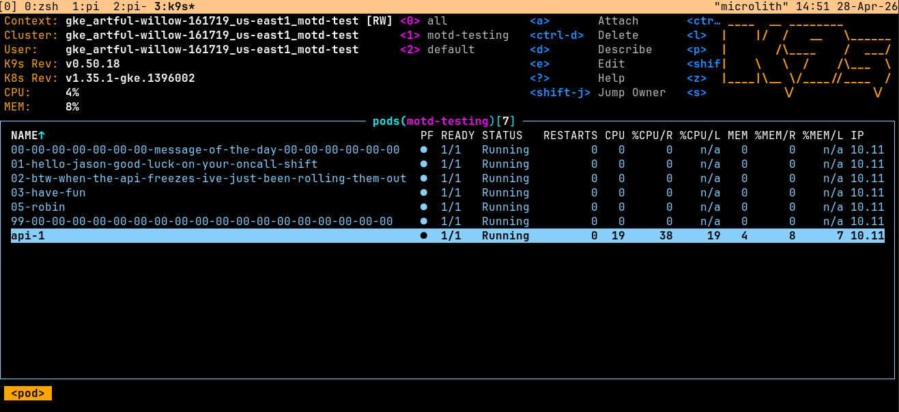

# motd-operator

Display messages in Kubernetes via pod names.



## What it does

Creates pods whose names spell out your message. View with `kubectl get pods` or in k9s to see your message displayed as a list of pods.

## Features

- Multi-line messages (newlines create separate pods)
- Header/footer framing with decorative zeros
- Word-boundary splitting
- k9s-compatible (58 char max per pod)
- Optional "crashloop" intensity for visual effects in k9s

## Quick Start

### Prerequisites

- Go 1.24+
- kubectl
- Access to a Kubernetes cluster

### Install the CRD

```sh
make install
```

### Run locally

```sh
make run
```

### Create a message

```sh
kubectl apply -f config/samples/
# or use the kubectl plugin
kubectl motd "Hello World"
```

### Uninstall

```sh
kubectl delete motd --all
make uninstall
```

## kubectl plugin

Install the `kubectl motd` plugin for easy message updates:

```sh
# Install
ln -s $(pwd)/hack/kubectl-motd ~/.local/bin/kubectl-motd

# Usage
kubectl motd Hello World
kubectl motd -n my-namespace Hello World
echo "Multi\nline\nmessage" | kubectl motd

# Default resource: motd-sample in default namespace
# Override with -n and --name flags
```

## API

```yaml
apiVersion: motd.motd.dev/v1alpha1
kind: Motd
metadata:
  name: my-message
spec:
  message: "Hello World"
  intensity: ""  # "crashloop" makes pods crash (red in k9s)
```

## Pod naming

Messages are encoded as pod names:

```
00-00-00-00-00-00-00-message-of-the-day-00-00-00-00-00-00    (header)
01-hello-world                                              (message)
02-second-line-here
99-00-00-00-00-00-00-00-00-00-00-00-00-00-00-00-00-00-00    (footer)
```

- Line numbers start at 01 (00 is header, 99 is footer)
- Words stay intact across pods
- Each pod max 58 chars (k9s display limit)

## Deploy to cluster

```sh
make docker-build docker-push IMG=your-registry/motd-operator:latest
make deploy IMG=your-registry/motd-operator:latest
```

## License

Apache 2.0
